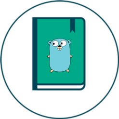

# go-templates

A repository hosting a collection of Go project templates.

These templates are designed to provide a solid starting point for various types of Go projects, promoting best practices and efficient development.

## templates

- [example-rest-api](./example-rest-api/): A fully functional REST API for managing books. Utilizes Gorilla Mux, middleware, validator for input validation, and features comprehensive API documentation with Swagger.

More templates coming soon.

## using `gonew` with `go-templates`
[gonew](https://go.dev/blog/gonew) is an experimental tool for creating new projects in Go from predefined templates. It simplifies the project setup process, allowing you to quickly clone and start working on a new project.

## contributing

Contributions to expand and improve the templates are welcome. Feel free to fork, submit pull requests, or open issues for new template ideas or enhancements.