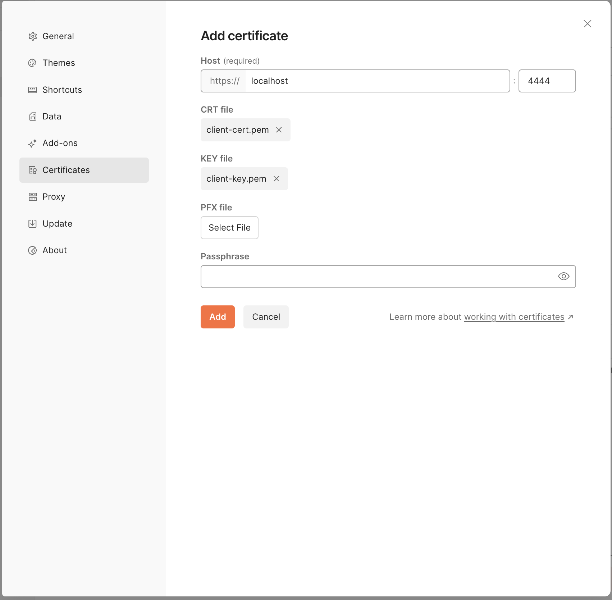
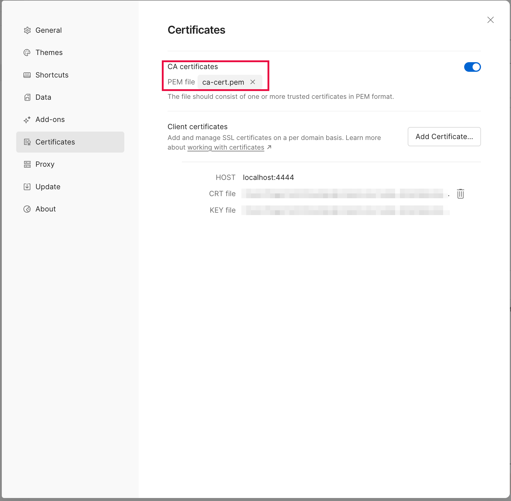
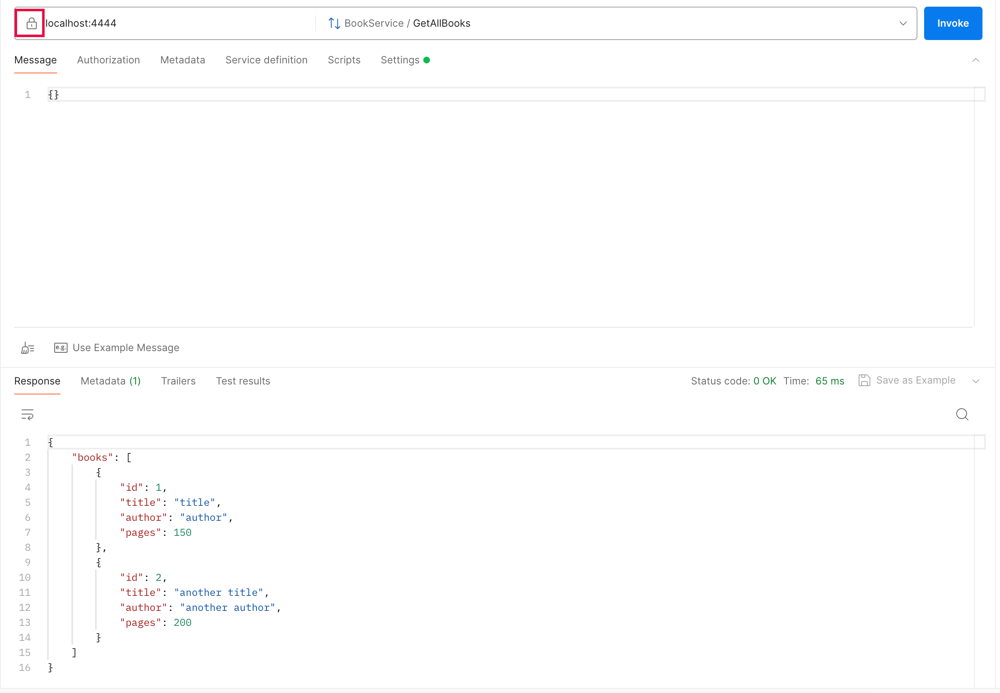

# example-grpc-crud-service-with-tls

Inspired in [an article of mine](https://www.linkedin.com/pulse/golang-dockerized-grpc-service-using-tls-tiago-melo), this project enhances [example-grpc-crud-service](../example-grpc-crud-service/) showing how to secure it with TLS.

## running it

1. generate both certificate and private key files

```
make gen-certs
```

2. run the server

```
make run PORT=<port>
```

### golang client

For client examples, check [examples/client](./examples/client) folder.

### Postman

1. In `Settings -> Certificates`



It will look like this:



2. Make the request. don't forget to enable TLS (lock icon)




## running tests

```
make test
```

## coverage report

```
make coverage
```