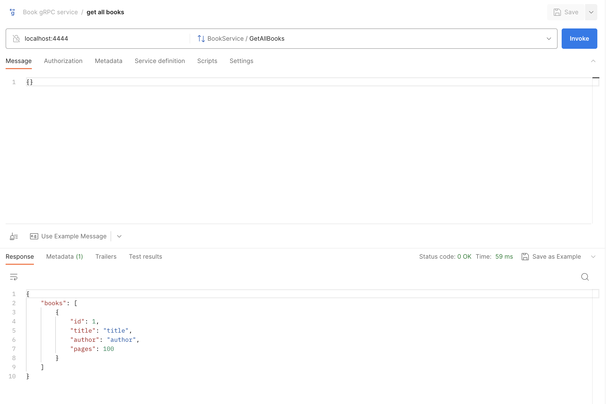

# example-grpc-crud-service

A sample gRPC service in Go, focused on CRUD (Create, Read, Update, Delete) operations for book management. This project serves as a detailed example of implementing a gRPC service, showcasing the power and efficiency of gRPC for building microservices and distributed systems.

## motivation

The creation of `example-grpc-crud-service` stems from the desire to bridge the gap between basic tutorials and real-world applications in the realm of gRPC services. Many available resources only cover the surface-level aspects of gRPC, leaving out the intricacies involved in setting up a full-fledged service. This project aims to fill this void by offering a near-production-ready template that demonstrates the practical implementation of a gRPC service in Go.

## key features

- Utilizes [Google's gRPC framework](https://grpc.io/), a high-performance, open-source universal RPC framework.
- Employs [Google's Protocol Buffers](https://protobuf.dev/) for defining structured data and interfaces, ensuring type safety and efficient serialization.
- Input validation with [validator](https://github.com/go-playground/validator).
- Database migrations handled by [golang-migrate](https://github.com/golang-migrate/migrate).
- Ensures 100% unit test coverage.

## running it

```
make run PORT=<port>
```

### available operations

For client examples, check [examples/client](./examples/client) folder.

I'm using [Postman](https://www.postman.com/) in these examples.

**create book**


**update book**


**get book**


**get all books**



**delete book**


## running tests

```
make test
```

## coverage report

```
make coverage
```

## compiling proto file

Instead of invoking local [protoc compiler](https://grpc.io/docs/protoc-installation/), I'm using a [Docker](https://www.docker.com/) image. 

```
make proto
```