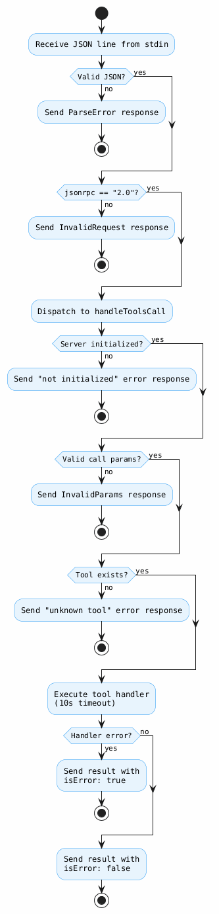

# example-mcp-server

A sample [Model Context Protocol (MCP)](https://modelcontextprotocol.io/) server implemented in [Go](https://go.dev/) from scratch, using [JSON-RPC 2.0](https://www.jsonrpc.org/specification) over stdio.

No third-party MCP libraries -- just the standard library and the MCP specification.

Supporting article: [https://tiagomelo.info/golang/mcp/2026/04/10/go-mcp-server.html](https://tiagomelo.info/golang/mcp/2026/04/10/go-mcp-server.html)

## Available tools

| Tool | Description |
|------|-------------|
| [`hello_world`](./tools/hello.go) | Returns a greeting message for the provided name |

## Adding a new tool

1. Implement the tool under the [tools](./tools/) folder. For example, `latency_percentiles` which computes min, p50, p95, p99, max and average for a list of numeric values:

**tools/percentiles.go**

```go
package tools

import (
	"math"
	"sort"

	"github.com/pkg/errors"
)

// PercentilesArgs defines the input for the Percentiles function.
type PercentilesArgs struct {
	Values []float64 `json:"values"`
}

// PercentilesResult defines the output of the Percentiles function.
type PercentilesResult struct {
	Count int     `json:"count"`
	Min   float64 `json:"min"`
	P50   float64 `json:"p50"`
	P95   float64 `json:"p95"`
	P99   float64 `json:"p99"`
	Max   float64 `json:"max"`
	Avg   float64 `json:"avg"`
}

// Percentiles calculates the count, min, p50, p95, p99,
// max, and average of the given values.
func Percentiles(args PercentilesArgs) (PercentilesResult, error) {
	if len(args.Values) == 0 {
		return PercentilesResult{}, errors.New("values must not be empty")
	}

	values := make([]float64, len(args.Values))
	copy(values, args.Values)
	sort.Float64s(values)

	var sum float64
	for _, v := range values {
		sum += v
	}

	return PercentilesResult{
		Count: len(values),
		Min:   values[0],
		P50:   percentile(values, 50),
		P95:   percentile(values, 95),
		P99:   percentile(values, 99),
		Max:   values[len(values)-1],
		Avg:   sum / float64(len(values)),
	}, nil
}

// percentile calculates the p-th percentile of a sorted slice of float64 values.
func percentile(sorted []float64, p float64) float64 {
	if len(sorted) == 1 {
		return sorted[0]
	}

	pos := (p / 100.0) * float64(len(sorted)-1)
	lower := int(math.Floor(pos))
	upper := int(math.Ceil(pos))

	if lower == upper {
		return sorted[lower]
	}

	weight := pos - float64(lower)
	return sorted[lower] + weight*(sorted[upper]-sorted[lower])
}

```

2. register the tool in [RegisterDefaultTools()](./tools/tools.go#L20) function at [tools/tools.go](./tools/tools.go) file:

**tools/tools.go**

```go
// RegisterDefaultTools registers the default tools
// with the provided server.
func RegisterDefaultTools(s *server.Server) {
    // ...
    
    s.RegisterTool(
		server.ToolDefinition{
			Name:        "latency_percentiles",
			Description: "Computes min, p50, p95, p99, max and average for a list of numeric values.",
			InputSchema: map[string]any{
				"type": "object",
				"properties": map[string]any{
					"values": map[string]any{
						"type":        "array",
						"description": "Numeric values, typically latency measurements in milliseconds.",
						"items": map[string]any{
							"type": "number",
						},
					},
				},
				"required": []string{"values"},
			},
		},
		func(ctx context.Context, raw json.RawMessage) (any, error) {
			var args PercentilesArgs
			if err := json.Unmarshal(raw, &args); err != nil {
				return nil, fmt.Errorf("decoding arguments: %w", err)
			}
			return Percentiles(args)
		},
	)
}
```

You can add a new tool after initializing the server as well:

```go
	mcpServer := server.New(os.Stdin, os.Stdout, logger)
	tools.RegisterDefaultTools(mcpServer)

	mcpServer.RegisterTool(
		server.ToolDefinition{
			Name:        "latency_percentiles",
			Description: "Computes min, p50, p95, p99, max and average for a list of numeric values.",
			InputSchema: map[string]any{
				"type": "object",
				"properties": map[string]any{
					"values": map[string]any{
						"type":        "array",
						"description": "Numeric values, typically latency measurements in milliseconds.",
						"items": map[string]any{
							"type": "number",
						},
					},
				},
				"required": []string{"values"},
			},
		},
		func(ctx context.Context, raw json.RawMessage) (any, error) {
			var args tools.PercentilesArgs
			if err := json.Unmarshal(raw, &args); err != nil {
				return nil, fmt.Errorf("decoding arguments: %w", err)
			}
			return tools.Percentiles(args)
		},
	)
```

3. After initializing and confirming server's initalization (as explained in the section bellow), call it:

```bash
{"jsonrpc":"2.0","id":3,"method":"tools/call","params":{"name":"latency_percentiles","arguments":{"values":[12.5,45.3,67.8,23.1,89.4,34.6,56.7,78.9,11.2,99.0]}}}
```

Output will be:

```bash
time=2026-04-11T17:49:43.996-03:00 level=INFO msg="tool call started" id=3 tool=latency_percentiles
time=2026-04-11T17:49:43.996-03:00 level=INFO msg="tool call succeeded" id=3 tool=latency_percentiles
{"jsonrpc":"2.0","id":6,"result":{"content":[{"text":"{\n  \"count\": 10,\n  \"min\": 11.2,\n  \"p50\": 51,\n  \"p95\": 94.67999999999999,\n  \"p99\": 98.136,\n  \"max\": 99,\n  \"avg\": 51.85\n}","type":"text"}],"isError":false,"structuredContent":{"count":10,"min":11.2,"p50":51,"p95":94.67999999999999,"p99":98.136,"max":99,"avg":51.85}}}
```

## Activity diagram

The following diagram illustrates the full request flow for a `tools/call`:



## Running

```bash
make run
```

This keeps stdin open so you can paste JSON-RPC messages interactively.

## Manual testing

### 1. Initialize

```json
{"jsonrpc":"2.0","id":1,"method":"initialize","params":{"protocolVersion":"2025-06-18","capabilities":{},"clientInfo":{"name":"manual-test","version":"0.1.0"}}}
```

### 2. Confirm initialization

```json
{"jsonrpc":"2.0","method":"notifications/initialized"}
```

### 3. Ping

```json
{"jsonrpc":"2.0","id":2,"method":"ping"}
```

### 4. List tools

```json
{"jsonrpc":"2.0","id":3,"method":"tools/list"}
```

### 5. Call tools

**hello_world**

```json
{"jsonrpc":"2.0","id":4,"method":"tools/call","params":{"name":"hello_world","arguments":{"name":"Tiago"}}}
```

## Tests

```bash
make test
```

## Coverage

```bash
make coverage
```

This generates `coverage.out` and `coverage.html`.